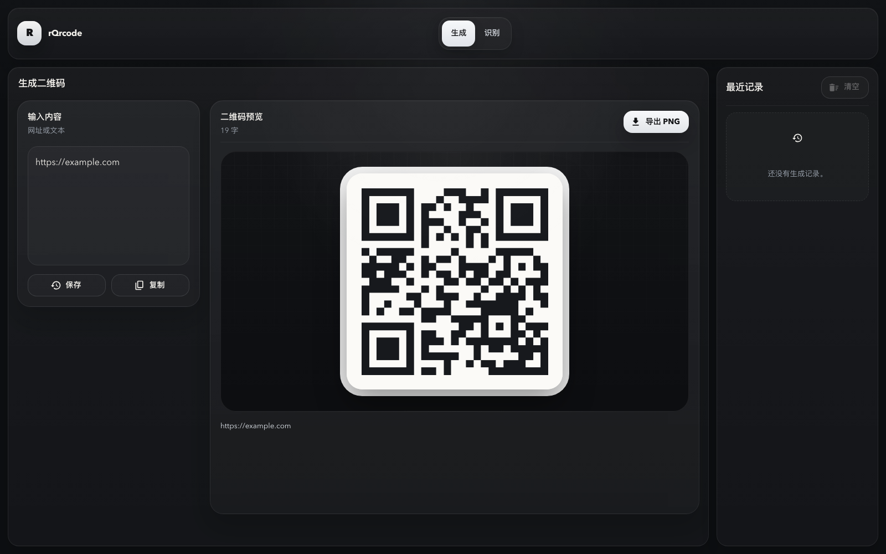

# rQrcode

`rQrcode` 是一个中文友好的轻量二维码桌面工具，适合日常生成、识别、复制和导出二维码，也提供稳定的原生 CLI，方便脚本和 AI Agent 调用。

技术栈：`Tauri 2 + Rust + React + Vite + TypeScript + Material UI`

## 功能

- 生成二维码并导出 PNG
- 从图片识别二维码内容
- 支持点击选择、拖拽图片、粘贴截图识别
- 识别结果一键复制
- 识别到网页链接时可直接打开
- 最近 10 条历史记录，支持单条删除和一键清空
- 原生 CLI 支持 `info`、`capabilities`、`encode`、`decode`
- `--json` 输出稳定，适合自动化和 AI 工具链

## 适合做什么

- 快速把文本或链接生成二维码
- 从截图、图片文件中识别二维码
- 在本地桌面完成二维码处理，不依赖在线服务
- 让 AI Agent 通过 CLI 生成/识别二维码，而不是操作 GUI

不计划在当前版本做批量码库管理、账号同步、云端识别服务或营销投放统计。

## 快速开始

```bash
npm install
npm run dev
```

打包桌面应用：

```bash
npm run build
```

检查 Rust 和测试：

```bash
npm run rust-check
npm run rust-test
```

## CLI 用法

开发期可以直接用 `cargo run`：

```bash
cargo run --manifest-path ./src-tauri/Cargo.toml -- info --json
cargo run --manifest-path ./src-tauri/Cargo.toml -- capabilities --json
```

构建后可执行文件位于 `./target/debug/rqrcode`：

```bash
cargo build --manifest-path ./src-tauri/Cargo.toml
./target/debug/rqrcode info --json
```

### 生成二维码

```bash
cargo run --manifest-path ./src-tauri/Cargo.toml -- \
  encode --text "https://example.com" --out /tmp/rqrcode.png --json
```

也可以从标准输入读取内容：

```bash
printf 'hello from stdin' | cargo run --manifest-path ./src-tauri/Cargo.toml -- \
  encode --stdin --out /tmp/rqrcode-stdin.png --json
```

`encode` 的别名是 `generate`。

### 识别二维码

```bash
cargo run --manifest-path ./src-tauri/Cargo.toml -- \
  decode --input /tmp/rqrcode.png --json
```

`decode` 的别名是 `recognize`。

### JSON 输出约定

成功时返回单个 JSON 对象：

```json
{
  "ok": true,
  "command": "encode",
  "data": {
    "outputPath": "/tmp/rqrcode.png"
  }
}
```

失败时同样只输出 JSON，并返回非零退出码：

```json
{
  "ok": false,
  "error": {
    "code": "invalid_arguments",
    "message": "text is required"
  }
}
```

## 给 AI / 自动化工具的建议

- 先运行 `rqrcode capabilities --json` 获取可用命令和示例。
- 需要生成图片时使用 `encode --text ... --out ... --json`。
- 需要识别文件时使用 `decode --input ... --json`。
- 不要通过 GUI 自动化生成二维码，CLI 更稳定。
- 文件路径建议传绝对路径，输出文件建议放在调用方可控目录。

## 开发命令

```bash
npm run web:build      # 前端生产构建
npm run rust-check     # Rust 类型检查
npm run rust-test      # Rust 测试
npm run size           # 查看构建缓存和产物体积
npm run clean          # 清理构建产物
npm run clean:all      # 清理构建产物和 node_modules
```

外部启动器可以使用：

```bash
npm run dev:sh
npm run build:sh
```

这两个脚本会清理继承的 `TAURI_*`、`CARGO_MANIFEST_*`、`CARGO_PKG_*`、`OUT_DIR` 等变量，避免从其他 Tauri app 启动时串配置。

## 数据与隐私

- 当前版本不启用 SQLite。
- 二维码历史仅保存在本地前端状态中。
- CLI 只读写用户显式传入的文件。
- 仓库不包含私有配置、token 或远程服务凭证。

## 项目结构

```text
src/               React 前端
src-tauri/         Tauri 壳、Rust CLI、二维码 core
scripts/           dev/build 启动脚本
public/            前端静态资源
```

## 许可证

MIT，见 [LICENSE](LICENSE)。

公开仓库边界、贡献约定与安全报告方式见 [PUBLIC_REPOSITORY.md](PUBLIC_REPOSITORY.md)、[CONTRIBUTING.md](CONTRIBUTING.md) 和 [SECURITY.md](SECURITY.md)。

## 界面预览与公开文档

公开截图使用 `https://example.com` 作为合成输入，不包含真实链接、二维码、账号或图片文件。



- [界面与公开演示说明](docs/interface-guide.md)
- [发布说明](RELEASE.md)
- [安全边界](SECURITY.md)
- [贡献指南](CONTRIBUTING.md)
